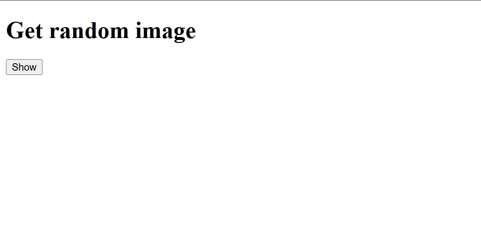
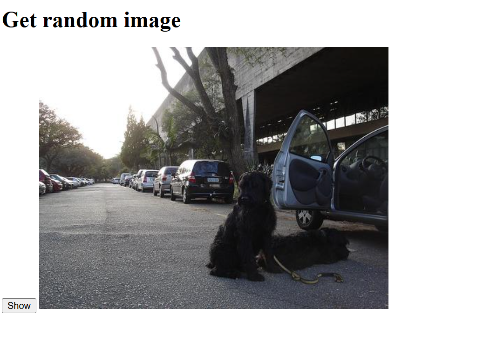
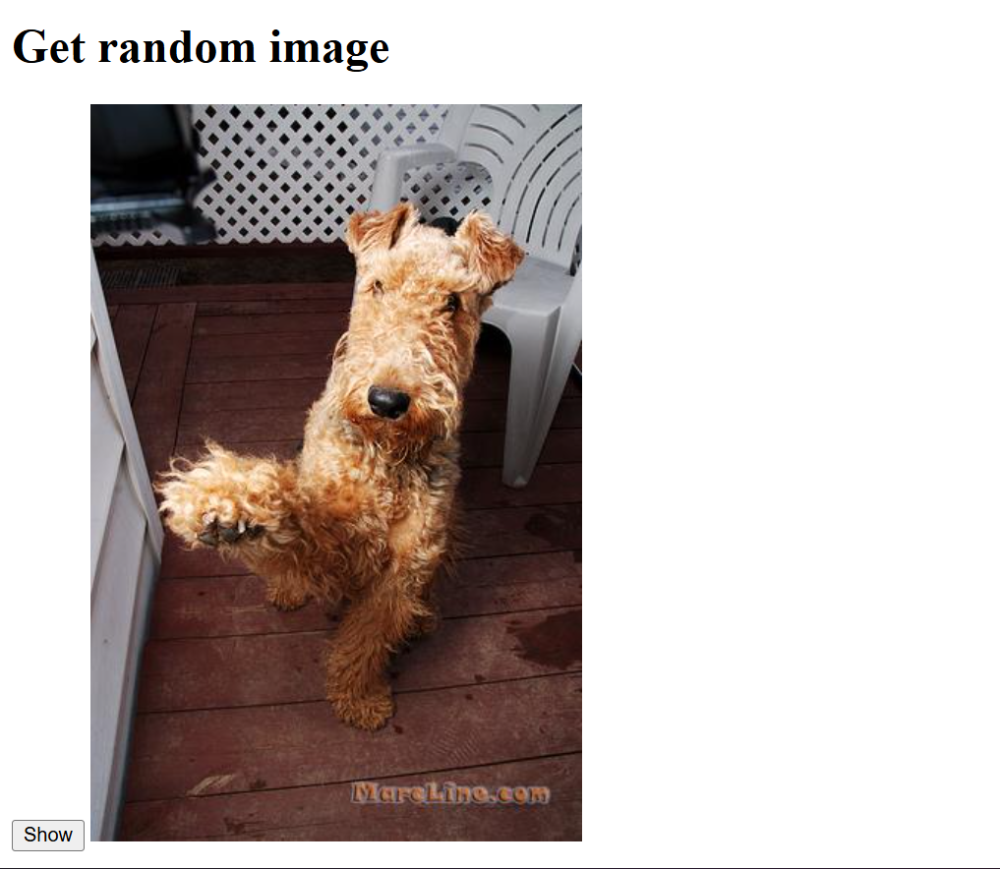

# 🐶 Dog Random Image Generator

This is a simple and fun web project that fetches random dog pictures using the [Dog CEO API](https://dog.ceo/dog-api/).  
Built with **HTML**, **CSS**, and **JavaScript (Axios)** for API calls.

---

## 📸 Preview

Below are screenshots of how the app looks:

| Initial Page | Random Dog Image 1 | Random Dog Image 2 |
|---------------|-------------------|-------------------|
|  |  |  |

---

## 🚀 Features
- Fetches a new random dog image on every click 🐾  
- Uses **Axios** for clean and simple API requests  
- Minimal and responsive design  
- Beginner-friendly for learning API calls & DOM manipulation  

---

## 🧠 Learning Purpose
This project helps you learn:
- How to work with public REST APIs  
- How to use Axios for API requests  
- Async/Await in JavaScript  
- Basic DOM manipulation  

---

## 🛠️ Technologies Used
- **HTML5**  
- **CSS3**  
- **JavaScript (ES6)**  
- **Axios CDN**

---

## ⚙️ How to Run

1. Clone this repository:
   ```bash
   git clone https://github.com/Digvej/dog-random-image-generator.git
